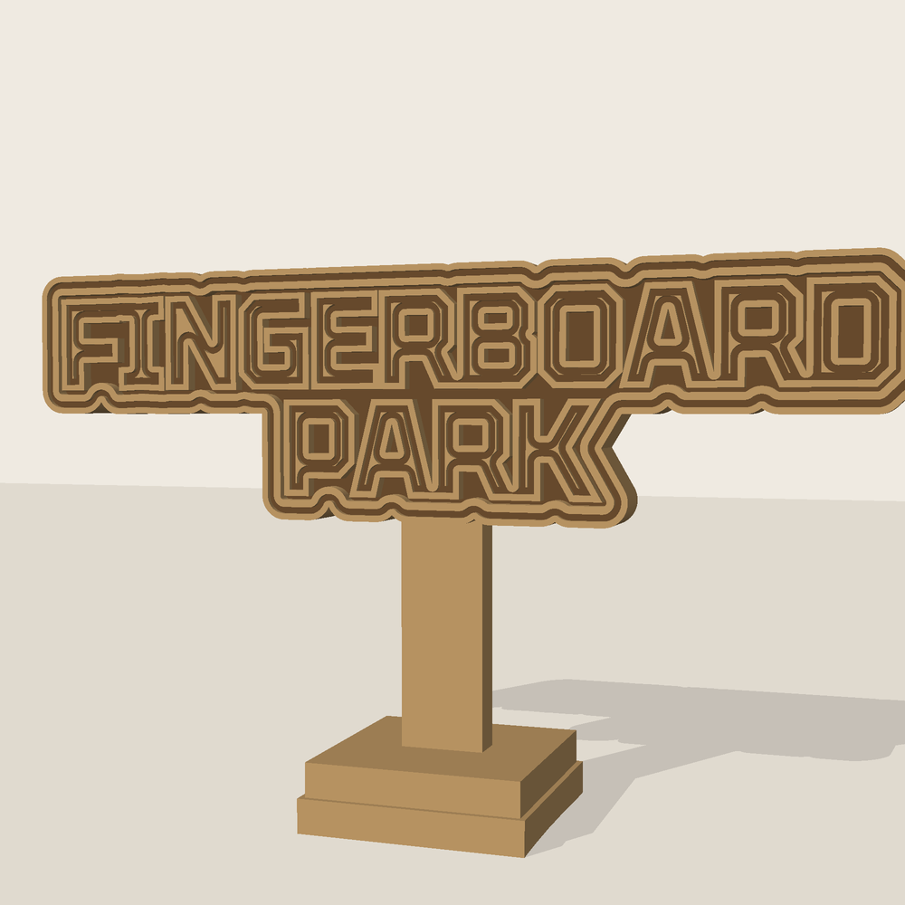
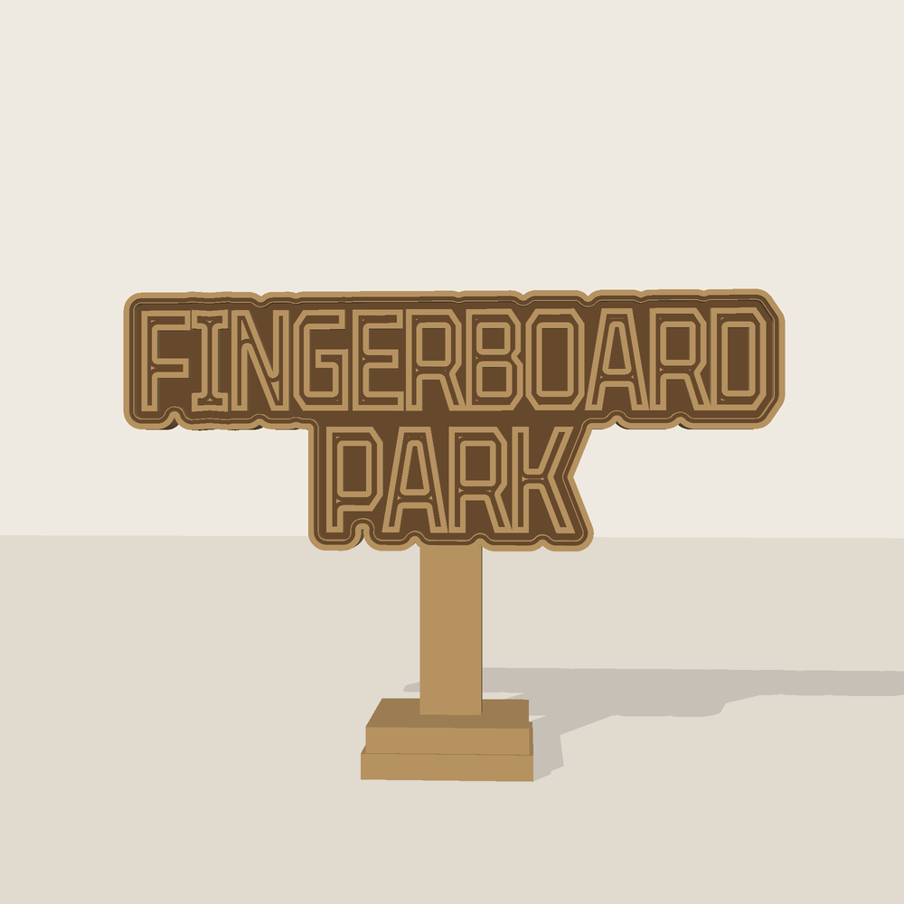
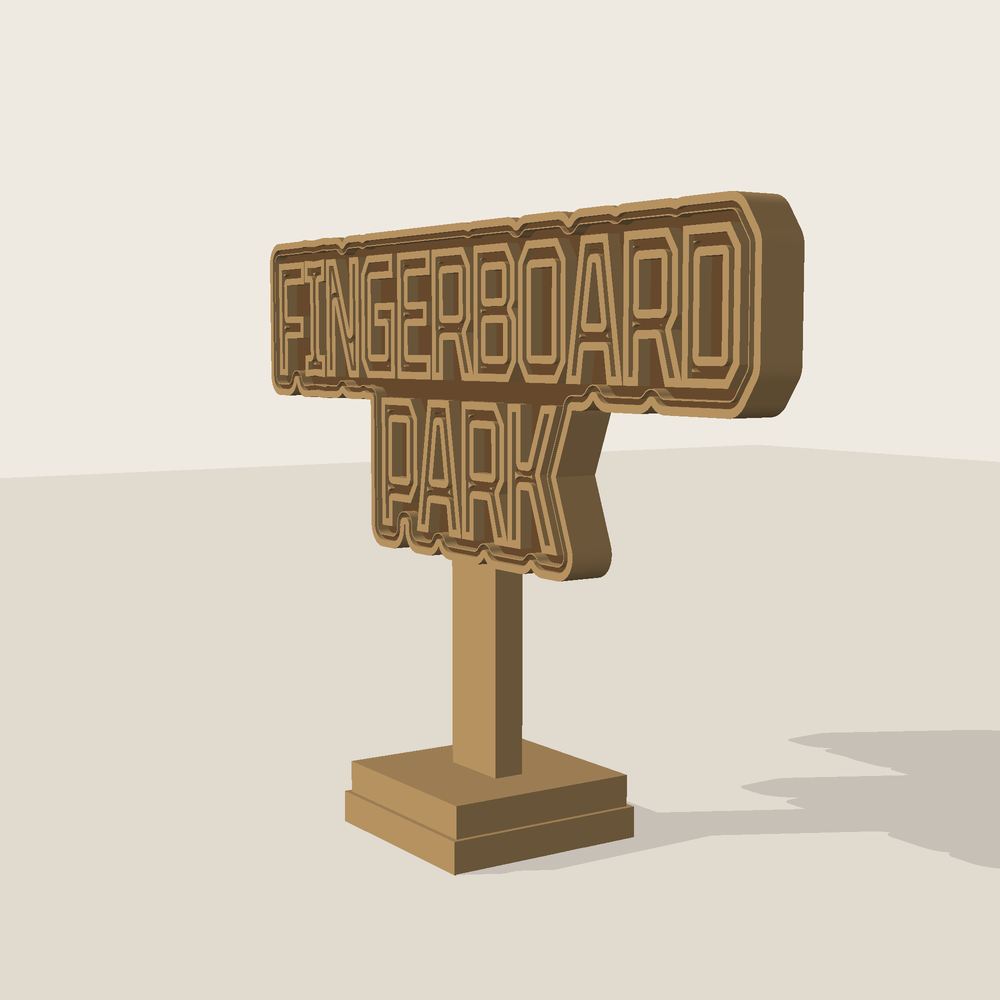

# FINGERBOARD PARK サイン — 3D モデル

指スケ（フィンガーボード）用の合板レーザーカット製ミニ看板を 3D モデル化したもの。
写真の実物を採寸のうえ再現し、パラメトリックなビルドスクリプトから
STL / GLB とレーザーカット用 SVG を生成する。



| | |
|---|---|
|  |  |

## 出力物

| ファイル | 用途 |
|---|---|
| [`out/fingerboard-park-sign.stl`](out/fingerboard-park-sign.stl) | 3D プリント（watertight・単一ソリッド） |
| [`out/fingerboard-park-sign.glb`](out/fingerboard-park-sign.glb) | ビューワ／Blender／Web 表示 |
| [`out/fingerboard-park-sign-lasercut.svg`](out/fingerboard-park-sign-lasercut.svg) | レーザー加工用（原寸 1:1） |
| `out/preview-*.png` | レンダリング画像 |

## 寸法

全体 **W 80.0 × D 20.0 × H 48.6 mm**（体積 7.78 cm³）。
指スケのデッキ（約 96 mm）と並べたときのスケール感に合わせてある。

| 部位 | 寸法 |
|---|---|
| 看板プレート | 80 × 22.6 mm / 板厚 3 mm |
| 文字（大文字高） | 8.7 mm、2 行（FINGERBOARD / PARK） |
| レリーフ（文字・フチの立ち上がり） | 1.2 mm |
| 彫り線（二重線） | 幅 0.6 mm / 深さ 0.5 mm |
| 支柱 | 幅 7.5 mm × 厚 3 mm、台座上面から 20 mm |
| 台座 | 20 mm 角 + 19 mm 角の合板 2 枚重ね（各 3 mm） |

## 構成の考え方

写真の実物は「板を彫り下げて文字とフチだけを残す」典型的なレーザー加工サイン。
モデルもその手順どおりに組み立てている。

1. 書体の輪郭をベクタとして取り出し、2 行に組む
2. 文字シルエットを 2.6 mm オフセットして角を丸め、プレート外形にする
3. プレートを厚 3 mm で押し出し、文字と外周フチ（幅 1.8 mm）を 1.2 mm 立ち上げる
4. 文字とフチの内側 0.55 mm に、幅 0.6 mm・深さ 0.5 mm の彫り線を掘る（写真の二重線）
5. 支柱と 2 枚重ねの台座を結合し、単一の watertight ソリッドにする

書体は実物に合わせ、角ばったグロテスク体 [Tektur](https://github.com/hyvyys/Tektur)
（SIL OFL, `src/fonts/OFL.txt`）を 0.72 mm 太らせて使用している。

## ビルド

```bash
pip install -r requirements.txt
python3 src/build.py      # STL / GLB を out/ に出力
python3 src/lasercut.py   # レーザーカット用 SVG を出力
python3 src/render.py     # プレビュー画像を出力
```

寸法・文字・書体はすべて `src/build.py` 冒頭の定数で変更できる。
たとえば文言を変えるなら `LINE1` / `LINE2`、大きさを変えるなら `TARGET_WIDTH` を触る。

| ファイル | 役割 |
|---|---|
| `src/build.py` | 寸法定義・2D 形状生成・3D ブーリアン・エクスポート |
| `src/glyphs.py` | TrueType の輪郭を shapely ポリゴンに変換 |
| `src/lasercut.py` | 切断／彫刻レイヤ分けした SVG を出力 |
| `src/render.py` | numpy + PIL の自前ラスタライザによるプレビュー生成 |
| `src/meshy.py` | Meshy OpenAPI クライアント（標準ライブラリのみ・下記参照） |

## レーザーカットで作る場合

SVG は 1 単位 = 1 mm の原寸。レイヤは色で分けてある。

- **赤 `#ff0000`** — 切断（本体シルエット、台座 2 枚とスリット）
- **青 `#0000ff`** — 彫刻ライン（文字の輪郭、その内側の二重線、外周の内側線）
- **グレー塗り** — 面彫刻（掘り下げる地の部分）

材料は 3 mm 合板。本体 1 枚と台座 2 枚を切り出し、支柱を台座のスリットに通して接着する。
スリットは板厚 3.0 mm ちょうどで引いてあるので、レーザーのカーフ分は加工機に合わせて調整のこと。

## Meshy で生成する

Meshy (https://meshy.ai) の OpenAPI を叩くクライアントを `src/meshy.py` に用意してある。
標準ライブラリのみで書いてあり、**Mac のローカルでもリモート実行環境でも同じコマンドで動く**
（プロキシと CA バンドルを環境変数から自動で拾う）。

```bash
export MESHY_API_KEY=msy_xxxxx

python3 src/meshy.py image reference/source-photo.jpg   # 写真から生成 (Image to 3D)
python3 src/meshy.py text --preset --refine             # プロンプトから生成 (Text to 3D)
python3 src/meshy.py status <task_id> --kind image      # 中断したタスクの再取得
python3 src/meshy.py image photo.jpg --dry-run          # 送信内容だけ確認 (通信しない)
```

生成物（glb / fbx / obj / usdz / テクスチャ / サムネイル / タスク JSON）は
`out/meshy/<種別>-<task_id>/` に保存される。`--polycount` `--topology` `--art-style`
`--no-pbr` などで調整できる。`--help` に一覧あり。

### セットアップ

**Mac のローカル**

```bash
export MESHY_API_KEY=msy_xxxxx     # ~/.zshrc に書いておくと楽
```

追加の依存はなし。`python3 src/meshy.py --help` が通れば準備完了。

**リモート実行環境（Claude Code on the web）**

このコンテナは Mac とは別環境なので、Mac 側で繋いだ連携はここからは見えない。
2 つ設定が要る（[環境の設定ドキュメント](https://code.claude.com/docs/en/claude-code-on-the-web)）。

1. **ネットワークポリシー** — 既定では egress プロキシが `api.meshy.ai` への CONNECT を
   403 で拒否する。環境設定で `meshy.ai` を許可ドメインに追加する
2. **環境変数** — 環境設定の環境変数に `MESHY_API_KEY` を追加する

いずれも既存セッションには反映されないので、設定後にセッションを作り直すこと。
疎通確認:

```bash
curl -sS -o /dev/null -w '%{http_code}\n' https://api.meshy.ai/    # 000 なら未開放
python3 src/meshy.py text --preset --dry-run                       # キー無しでも動く
```

### 本モデルとの使い分け

Meshy が返すのはスキャン風のメッシュとテクスチャで、寸法は保証されない。
一方この `src/build.py` が出すのは寸法が確定した CAD 的ソリッドで、そのまま原寸で加工できる。

- **原寸で作りたい / レーザーや 3D プリントに流したい** → `src/build.py` の出力
- **見た目・質感重視のビジュアルが欲しい** → Meshy

### API 仕様について

エンドポイントとバージョンは `src/meshy.py` 冒頭の `BASE` / `EP_IMAGE` / `EP_TEXT` /
`AI_MODEL` にまとめてある。この環境からは meshy.ai に到達できず実通信での検証ができて
いないため、動かない場合は [公式ドキュメント](https://docs.meshy.ai/) と突き合わせて
この定数だけ直せば追従できる。
